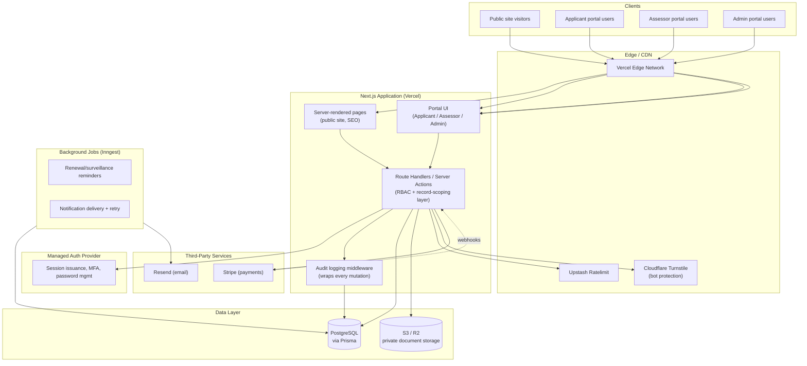

# Phase 11 — Technical Architecture

Builds on Phases 1–10 (approved, all UX/content specified). This is the first phase with real implementation decisions. Each choice below is evaluated against the actual requirements from Phases 1–10, not assumed — the brief's suggested stack is used only where it holds up against that evaluation.

---

## 1. Requirements That Drive the Architecture

Before picking anything, the decisions have to satisfy:
- Three distinct portals (Applicant/Assessor/Admin) with **record-level** RBAC, not just role-level (Phase 1, Phase 8/9/10 access rules).
- A public site that needs real SEO (Phase 1 Should-Have, Phase 6 content depth) — server-rendered, not a pure SPA.
- A verification page that must **never serve stale status** (Phase 7) — rules out aggressive static caching for that one surface specifically.
- Private document storage with signed, time-limited URLs (Phase 1).
- An append-only audit log written automatically on every state-changing action across every portal (Phase 1, repeated as a hard requirement in every later phase).
- Scheduled/background work: renewal reminders, notification delivery, deadline flags (Phase 8/10) — not purely request/response.
- Moderate scale (tens–low hundreds of accredited organisations, per Phase 1's assumption) — this matters: it rules out over-engineering toward microservices/queues sized for scale this platform doesn't have yet, and argues for a stack the platform can operate with a small team.
- Security posture appropriate to handling applicant PII and assessment documents: MFA for privileged roles, rate limiting, bot protection, secure sessions (Phase 1).

---

## 2. Stack Decision

| Layer | Choice | Why |
|---|---|---|
| Frontend | **Next.js (App Router) + TypeScript** | Server rendering covers the public-site SEO requirement; one framework serves both the marketing site and the three portals, which matters for a small team maintaining this. |
| UI | **Tailwind CSS** + a hand-built component library implementing the Phase 4 design tokens directly (not a generic component kit re-skinned) | Fastest accurate path from the Phase 4 token system to real components; avoids the "reskinned template" look the whole brief is trying to avoid. |
| Backend | **Next.js Route Handlers + Server Actions — no separate NestJS service** | At this scale, a second backend service adds deployment/ops complexity without a matching benefit; record-level RBAC and audit logging are enforced in a shared server-side data-access layer regardless of framework, so a separate service wouldn't simplify that part either. *(Revisit only if real scale/team-size assumptions change — see Section 9.)* |
| Database | **PostgreSQL**, via **Prisma ORM** | Relational integrity (foreign keys, enums for status states) matters more here than for a typical CRUD app, because status states (application stage, accreditation status, verification status) are load-bearing for trust, not cosmetic. Prisma's migration history doubles as a natural schema audit trail during development. |
| Auth | **Managed auth provider** (e.g., WorkOS AuthKit or Clerk — final pick pending your vendor/budget preference) for credential storage, session issuance, and MFA mechanics, with **custom RBAC + record-scoping logic in the application layer** on top | Rolling password storage, MFA, and session security by hand is exactly the kind of security surface area this platform shouldn't build from scratch; but role/record-level authorization is inherently application-specific and has to be custom regardless of provider. |
| File storage | **S3-compatible object storage** (AWS S3 or Cloudflare R2), private bucket, **signed URLs generated per authorised request**, never a public bucket/URL | Directly implements Phase 1's document security requirement. |
| Email | **Resend** (default) — AWS SES as a lower-cost fallback at higher volume | Good deliverability, straightforward Next.js integration, transactional-email-focused. |
| Background jobs | **Inngest** (or Vercel Cron for the simplest scheduled jobs) | Renewal reminders, notification retries, and deadline-flagging need to run on a schedule / react to events outside the request/response cycle — this is the one place a "just use Next.js for everything" answer doesn't fully cover. |
| Payments | **Stripe** (Invoicing + Checkout) | Handles invoice generation, payment collection, and receipts without building billing logic from scratch. |
| Hosting | **Vercel** (app) + managed Postgres (**Neon** or **Supabase**, final pick a cost/ops preference) + S3/R2 (storage) | Matches the Next.js-first decision; managed Postgres avoids operating a database server for a team this size. |
| Rate limiting / bot protection | **Upstash Ratelimit** (Redis-backed, serverless-friendly) on auth and verification-search endpoints; **Cloudflare Turnstile** on public forms | Directly implements Phase 1's rate-limiting/bot-protection requirements without a heavyweight WAF the team would need to operate. |

**Where this deviates from the brief's suggested stack:** no separate NestJS service (Section 2 rationale), and auth is explicitly built on a managed provider rather than left open-ended — both are evaluated calls given the actual team-size and scale assumptions in Phase 1, and both are reversible if those assumptions turn out wrong (Section 9).

---

## 3. Architecture Diagram

---

## 4. Application Architecture

Single Next.js application, three route groups sharing the same codebase and design system:
- `(public)` — server-rendered, SEO-optimised, no auth required.
- `(portal)/applicant`, `(portal)/assessor`, `(portal)/admin` — authenticated, role-gated at the route-group level (a hard boundary — an Assessor route literally cannot render for a user without the Assessor role) *and* record-scoped within each route (an Assessor route renders, but the data-access layer refuses to return a record the current user isn't assigned to).
- Shared component library (`/components`) implements the Phase 4 design system once; public and portal UIs consume the same primitives at different densities, per Phase 4's density rule.
- A single server-side **data-access layer** (not ad hoc queries scattered through route handlers) is where RBAC checks and audit-log writes are enforced centrally — this is deliberate: it means a developer can't accidentally ship a new admin action that forgets to check permissions or log the change, because both are structurally part of how any mutation happens, not a checklist item to remember.

---

## 5. Database Architecture (high-level — full entity design in Phase 12)

PostgreSQL, accessed via Prisma. Key architectural commitments carried into Phase 12:
- Status fields (application stage, accreditation status, verification status) are **Postgres enums**, not free-text strings — makes an invalid status a schema-level impossibility, not just an application-level bug.
- Verification records are a **separate table** from accreditation records (Phase 2/10 decision), with an explicit field-mapping/curation relationship, not a view that mirrors everything.
- Audit log is an **append-only table** — the application role used by the API has `INSERT` but not `UPDATE`/`DELETE` grants on it at the database level, so even a bug in application code can't silently rewrite history.

---

## 6. Authentication Architecture

- Managed provider issues sessions (secure, httpOnly, short-lived, refresh-token rotation) and handles MFA (TOTP) for Admin/Assessor (required) and Applicant (available/encouraged), per Phase 1.
- Application layer maps the authenticated identity to a role + organisation/assignment scope on every request; this scope check happens in the shared data-access layer (Section 4), not per-page.
- Password recovery: provider-handled secure token flow, rate-limited (Phase 1 requirement satisfied by provider + Upstash Ratelimit in front of the endpoint).
- Session management: active-session list and revoke action (Phase 8/9's Security pages) implemented against the provider's session API.

---

## 7. File Storage Architecture

- Private S3/R2 bucket, no public read access at the bucket level.
- Uploads go through the Next.js API (not direct browser-to-bucket) so the RBAC/audit layer sees every upload; the API issues a short-lived pre-signed PUT URL for the actual transfer to avoid routing large files through the application server.
- Downloads/views: API issues a short-lived pre-signed GET URL per authorised request, never a stored public link — satisfies Phase 1's document-security requirement and Phase 8's "documents are per-record, not shareable outside context" behaviour.
- Document versions (Phase 8) are separate objects in storage, linked by a `document_versions` table — never overwritten in place.

---

## 8. Verification Architecture

- `/verify/[reference]` is **dynamically rendered on every request** (no static generation, no long-TTL cache) — directly implements Phase 7's "must never serve stale status" rule. A short edge-cache TTL (seconds, not minutes) is acceptable for read load, with **cache invalidation triggered on any accreditation/verification-record status change** (a status change in the admin portal actively purges the cached page rather than waiting out a TTL) — belt-and-suspenders freshness.
- Search (`/verify?q=`) queries the database directly through the same rate-limited API path as everything else; no separate search index needed at this scale (a search index becomes worth adding only well past "low hundreds of records").

---

## 9. Notification Architecture

- Every notification-worthy event (stage change, decision recorded, document requested, invoice issued, deadline approaching) writes a `notification` record and enqueues delivery via Inngest.
- Email delivery through Resend; in-app notification (Phase 1 Should-Have) reads directly from the `notification` table.
- Renewal/surveillance reminders (Phase 8's open question on cadence) run as a scheduled Inngest job checking upcoming due dates daily against the configured lead-time settings (Phase 10 Settings page) — cadence is admin-configurable, not hardcoded.
- Delivery log (Phase 10's Notifications section) reads Resend's delivery status via webhook, stored against the notification record — answers "did they actually get this email."

---

## 10. Payment Architecture

- Stripe Invoicing for structured application/assessment/annual fees; Stripe Checkout for direct payment collection.
- Stripe webhooks update invoice status in Postgres (source of truth for the admin Payments screen), rather than the application polling Stripe.
- Manual reconciliation actions (Phase 10: "mark paid," credit notes) write directly to Postgres with the mandatory-reason/audit pattern, for offline payments Stripe doesn't see.

---

## 11. Audit Architecture

- Centralized `logAuditEvent()` call inside the shared data-access layer (Section 4) — every mutation path calls it as part of the same transaction as the underlying write, so an audit entry and its corresponding data change either both commit or neither does (no risk of a logged action that didn't actually happen, or vice versa).
- Schema: actor (user + role), action, target record type/ID, timestamp, before/after JSON snapshot where meaningful, request context (IP, not more than needed for security purposes — data minimization).
- Database-level `INSERT`-only grant (Section 5) as a defense-in-depth measure beyond the application-level guarantee.

---

## 12. Assumptions

1. Auth provider choice (WorkOS vs. Clerk vs. an alternative) is a budget/vendor preference not yet made — either satisfies the architecture as designed.
2. Managed Postgres provider (Neon vs. Supabase) is similarly a cost/ops preference; either works.
3. Team size is assumed small enough that a single Next.js deployable (no separate backend service) is the right complexity level — flagged explicitly as reversible if real staffing differs from this assumption.

## 13. Questions / Decisions Needed

1. Any existing vendor relationships/preferences (cloud provider, auth provider, payment processor) that should override the defaults above?
2. Confirm the moderate-scale assumption still holds (tens–low hundreds of accredited organisations) — it's the basis for choosing a single-deployable architecture over a more distributed one.
3. Jurisdiction/data-residency requirements not yet confirmed (Phase 1 open question) may constrain which cloud region(s) storage and database must live in — worth confirming before Phase 13 environment setup.

None block proceeding to Phase 12 — the data model doesn't depend on resolving vendor choices, only on the architectural shape decided here (Postgres, enums for status, append-only audit table, separate verification-record table).

---

## Next Phase

**Phase 12 — Database & Data Model**: full entity definitions (Users, Organisations, Applications, Programs, Accreditation Records, Scopes, Assessors, Assessments, Findings, Documents, Document Versions, Payments, Invoices, Notifications, Messages, Verification Records, Audit Logs) with fields, relationships, constraints, and statuses.
